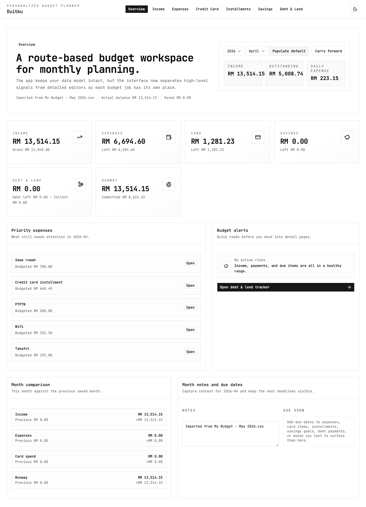

# Duitku

Duitku is a personal budget planner built with React, TypeScript, Vite, and shadcn/ui.
It helps track monthly income, expenses, credit card spending, installments, savings goals, and debt/lend records in one place.

## Screenshot



## Features

- Monthly overview dashboard
- Income tracking
- Expense tracking
- Credit card tracking
- Installment tracking
- Savings goals
- Debt & lend tracker
- Month notes and carry-forward workflow
- Supabase-backed persistence

## Tech stack

- React
- TypeScript
- Vite
- TanStack Router
- shadcn/ui
- Supabase
- Cloudflare-ready Vite setup

## Getting started

### 1. Install dependencies

```bash
pnpm install
```

### 2. Run the app

```bash
pnpm dev
```

### 3. Build for production

```bash
pnpm build
```

## Supabase setup

This app stores budget data in Supabase relational tables and syncs through RPC functions.

### Required frontend env vars

Create a `.env` file in the project root:

```bash
VITE_SUPABASE_URL=your_supabase_project_url
VITE_SUPABASE_PUBLISHABLE_KEY=your_supabase_publishable_key
# optional fallback if you use anon key naming instead
VITE_SUPABASE_ANON_KEY=your_supabase_anon_key
```

The frontend accepts either:
- `VITE_SUPABASE_PUBLISHABLE_KEY`
- or `VITE_SUPABASE_ANON_KEY`

### Apply the database migrations

If you already have the Supabase CLI installed:

```bash
supabase link --project-ref <your-project-ref>
supabase db push
```

If Homebrew installation is blocked on macOS, you can use the CLI through `npx`:

```bash
npx supabase@latest link --project-ref <your-project-ref>
npx supabase@latest db push
```

### Database objects used by the app

Core tables:
- `public.budget_settings`
- `public.budget_months`
- `public.budget_income`
- `public.budget_expenses`
- `public.budget_credit_card_items`
- `public.budget_installments`
- `public.budget_savings_goals`
- `public.budget_debts`
- `public.budget_lends`

RPC functions:
- `public.get_budget_data()`
- `public.save_budget_data(jsonb)`
- `public.reset_budget_data()`
- `public.populate_budget_month(text)`

### Notes

- The canonical SQL changes live in `supabase/migrations/`.
- If you prefer the Supabase dashboard, run the migration SQL files there in order.
- This setup is designed for a personal app workflow.

### Security note

This project currently uses direct browser access to Supabase for convenience.
If row-level security is disabled and you expose your anon key publicly, anyone with the project URL and key may be able to access the budget tables and RPCs.
Lock this down before using it in a multi-user or public production environment.

## Scripts

```bash
pnpm dev        # start local dev server
pnpm build      # production build
pnpm typecheck  # TypeScript check
pnpm lint       # ESLint
pnpm preview    # build and run Wrangler preview
pnpm deploy     # build and deploy with Wrangler
```

## Project structure

```text
src/
  app/
  components/
  features/budget/
  hooks/
  lib/
  routes/
supabase/
  migrations/
```
